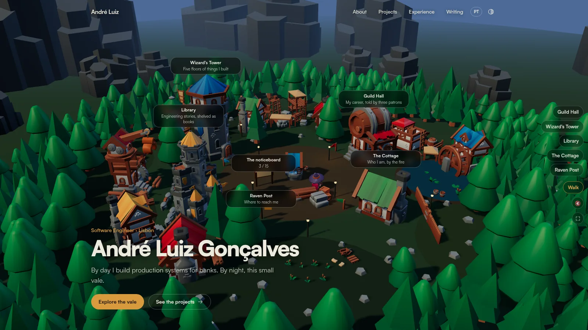
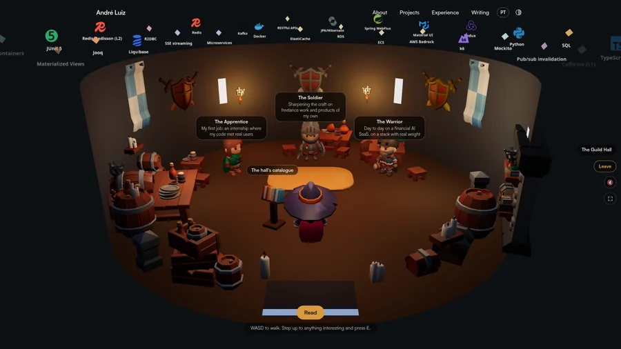
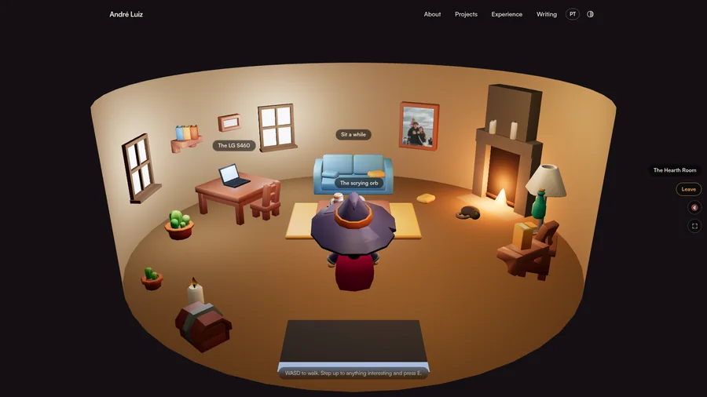

<!-- prettier-ignore -->
<div align="center">


# Wizard Vale

[](https://myportfolio.beyouweb.com)
[](https://astro.build)
[](https://r3f.docs.pmnd.rs)
[](https://pages.cloudflare.com)
[](#credits)

**A portfolio you walk around in.**



</div>

Every section of the site is a place. The Guild Hall holds my work experience as a
quest board, the Wizard's Tower holds my projects, the Library holds my writing,
the Cottage is about me, and the Raven Post is how you reach me. You can walk
there as a wizard, or click and let the camera fly.

The whole thing is an Astro static site with one React Three Fiber island in the
hero. Every word of content is real DOM in an overlay panel, in English and
Portuguese, so the site is readable, translatable, indexable and fast whether or
not the 3D ever loads.

## Two ways in

- **Walk.** WASD, arrow keys, or a touch joystick. Get close to a door and press
  <kbd>E</kbd> to go inside.
- **Click.** A dock of shortcuts flies the camera to each place and slides in its
  panel. The plain pages (`/about`, `/projects`, `/experience`, `/writing`) are
  there too, prerendered and fast, and they are also the SEO layer.

> [!NOTE]
> The 3D island is lazy-loaded, gated on WebGL, and skipped entirely under
> `prefers-reduced-motion`. When it does not load, the site is still the site.

## What is in there

- **Four enterable, furnished buildings**, each with its own floors, props and
  boards: `src/islands/vale/interiors.ts`
- **The vale keeps your clock.** It is dusk here when it is dusk where you are,
  with the sun, fog, lantern light and stars all following from one blend:
  `daylight.ts`
- **A voice for each room.** Wind and crickets outside, a minstrel in the hall,
  silence in the Library but for footsteps and turning leaves, a fire and a piano
  at home. Off by default, because a site that makes noise unasked deserves the
  back button: `ambience.ts`
- **Fifteen badges** on a noticeboard in the plaza, kept in your browser and
  nowhere else: `src/data/achievements.ts`
- **A cat.** She sleeps by the fire in the Cottage. Pet her and she comes along:
  `Familiar.tsx`
- **Other people.** Anyone visiting at the same time is walking around in there
  with you, in their own colour, with one word about what they are doing.
- **A crystal ball** in the Cottage showing whether the Beyou servers are up,
  read live from GlitchTip through a Cloudflare Function.

<table>
<tr>
<td width="50%"></td>
<td width="50%"></td>
</tr>
<tr>
<td>The Guild Hall: three patrons, one per age of the career, under everything I have worked with.</td>
<td>The Cottage: one object per thing worth saying, and the only warm room in the vale.</td>
</tr>
</table>

## Getting started

```bash
npm install
npm run dev           # dev server
npm run build         # static build to dist/
npm run preview       # serve that build
npm run preview:live  # ...and run the Cloudflare Function with it
```

`preview` is enough for everything except the scrying orb: `astro preview` does
not run Cloudflare Functions, so `/api/status` would 404 and the orb would show
its clouded state. Use `preview:live` to review it for real.

> [!TIP]
> To see the orb reading the real monitors rather than the four-URL fallback,
> copy `.dev.vars.example` to `.dev.vars` and paste a GlitchTip API token. That
> file is git-ignored.

Content lives in `src/i18n/ui.ts` (all copy, both languages) and `src/data/`
(quests, projects, writing, contact). The world itself — building positions,
camera targets, walk physics — lives in `src/islands/vale/world.ts`.

## Multiplayer

Everyone in the vale sees everyone else: their colour, where they are, and one
word for what they are doing. The control sits next to the sound one and is on
by default. Switching it off closes the socket rather than hiding anybody, so
nothing about that visitor leaves their browser afterwards.

It carries a colour, a room, a position and one word from a closed set. No name,
no account, no database. The server hands out the ids and forgets them when the
tab closes, so two visits by the same person are not connected to each other.

### Running it locally

Two terminals. The first is the presence server, the second the site pointed at
it:

```bash
npm run presence:dev
npm run dev
```

Then open <http://localhost:4321> twice: one normal window and one private
window, so they have separate storage, roll different colours, and you can tell
them apart. In dev the site defaults to the local worker, so that is the whole
setup. For the production build instead, use
`PUBLIC_PRESENCE_URL=ws://localhost:8787/green npm run preview:mp`.

To try it on a phone at the same time, both servers already listen on the whole
network, so point the variable at this machine instead:

```bash
# find this machine's address: `ip -4 addr` on Linux, `ipconfig` on Windows
PUBLIC_PRESENCE_URL=ws://192.168.x.y:8787/green npm run preview:mp
```

and open `http://192.168.x.y:8788` on the phone. Private addresses are on the
origin allowlist for exactly this.

### How it works

One Durable Object holds the room over hibernating WebSockets, in a Worker of
its own under `presence/` so it cannot affect the site. Durable Objects are on
the Workers free plan with the SQLite backend, and incoming WebSocket messages
bill at 20:1, so the free 100k requests a day is about two million messages. The
client only sends when something actually changed: standing still sends nothing
at all.

`presence/src/index.ts` allowlists the site's origins, assigns the ids, caps the
room at 48 people, rate-limits each socket, and validates every field against
closed sets, so a peer cannot push text into anyone else's screen. A socket that
goes quiet for more than a minute is closed and announced as gone, because a
phone that sleeps does not always close cleanly and the alternative is a
stranger standing in the plaza forever.

The control tells you which state it is in, which matters because being alone
and being unable to reach anybody look identical otherwise:

| Control says | Means |
| --- | --- |
| no control at all | no `PUBLIC_PRESENCE_URL` in this build |
| joining | connecting |
| cannot reach the vale | the server is not answering |
| showing | connected |

## Deploy

Cloudflare Pages, connected to this repo. Framework preset **Astro**, build
command `npm run build`, output directory `dist`. `site:` in `astro.config.mjs`
is already set to the real domain so canonical and OG tags point at it.

Two environment variables on the project:

| Variable | Type | Without it |
| --- | --- | --- |
| `GLITCHTIP_TOKEN` | Secret | The orb falls back to probing the public Beyou URLs from the edge |
| `PUBLIC_PRESENCE_URL` | Text | The vale is single-player and its control does not appear |

> [!IMPORTANT]
> Pages binds environment variables per deployment, so adding one and not
> rebuilding does nothing at all. Retry the deployment, or push.
>
> `PUBLIC_PRESENCE_URL` has to be **Text**, not Secret: Vite reads it during the
> build and it ends up in the bundle either way. It is a public address behind an
> origin allowlist, not a secret.

The presence Worker deploys separately, once:

```bash
npm run presence:deploy
```

Then set `PUBLIC_PRESENCE_URL` to the `wss://.../green` address it prints, and
rebuild the site.

## Known gaps

- The cat has no colliders. Lead her into a table and she walks through it. She
  mostly follows where you have already walked, so it rarely shows, and giving
  her collision would mean a second movement system for a cat.
- Multiplayer has been tested against a real deployed Worker, but never with
  several real people on real connections. The interpolation is tuned for about
  five updates a second; `EASE` in `Peers.tsx` is the number to change if it
  looks jumpy, and `MAX_PEERS` in the Worker if a crowd gets heavy.
- The vale runs at something under 30fps on a mid-range Android. Playable, not
  smooth.

## Credits

3D models by [Kay Lousberg](https://www.kaylousberg.com), all CC0: Medieval
Hexagon and City Builder for the village, Dungeon Remastered for what fills the
rooms, Adventurers for the wizard and the three patrons, Furniture Bits for the
Cottage. Tech logos from [Simple Icons](https://simpleicons.org), CC0.

The cat is not from any of them. No pack ships an animal, so both cats — the one
asleep by the fire and the one that follows you — are built out of primitives in
`Interior.tsx` and `Familiar.tsx`.

Sound is synthesised in the browser except for four recordings, all CC0 or
public domain:

| Sound | Source |
| --- | --- |
| The cat's purr | [Purring cat](https://commons.wikimedia.org/wiki/File:Purring_cat.oga) by Mysid, cut to 1.3s |
| The hearth | [Fireplace Sound loop](https://opengameart.org/content/fireplace-sound-loop) by pagdev, cut to a seamless 14s loop |
| The Guild Hall | [Medieval: Minstrel Dance](https://opengameart.org/content/medieval-minstrel-dance) by randommind |
| The vale | [Medieval: Harvest Season](https://opengameart.org/content/medieval-harvest-season) by randommind, cut to a 32.6s loop |

The purr was chosen by measurement rather than by name: most purr recordings put
almost everything below 80Hz, which laptop and phone speakers cannot reproduce,
so they play as silence. This one is close-miked and nearly flat past 3kHz.
